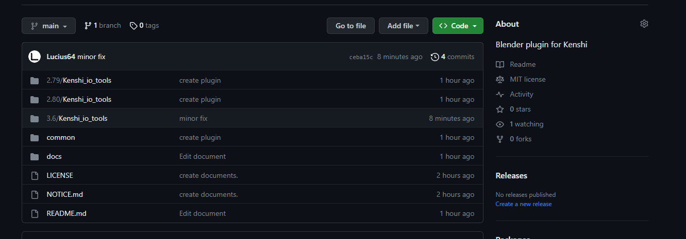
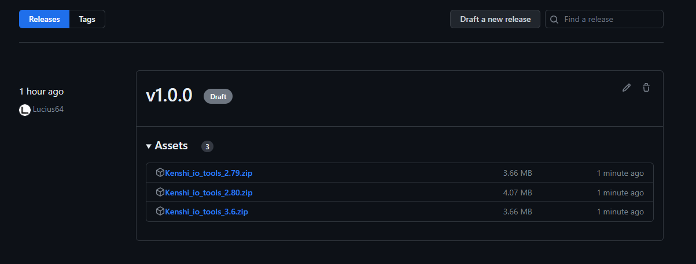
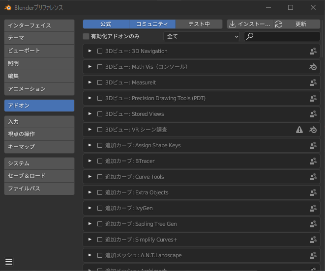
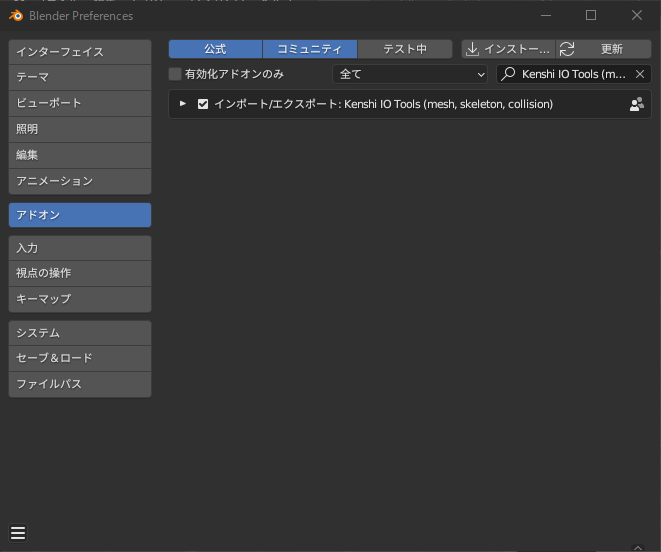

# インストール方法

1. [Release](https://github.com/Lucius64/kenshi_io_tools/releases)に移動

    

1. ZIPファイルをダウンロード

    
    - 使用するBlenderのバージョンに応じてダウンロードします。

        | Blender バージョン | ターゲット バージョン |
        | --- | --------- |
        | 2.79 | 2.79 |
        | 2.80 to 3.5 | 2.80 |
        | 3.6 or higher  | 3.6 |

1. Blenderを起動
1. プリファレンスを開き、アドオンの「インストール」をクリック

    

1. ダウンロードしたZIPファイルを選択

1. アドオンを有効化

    

