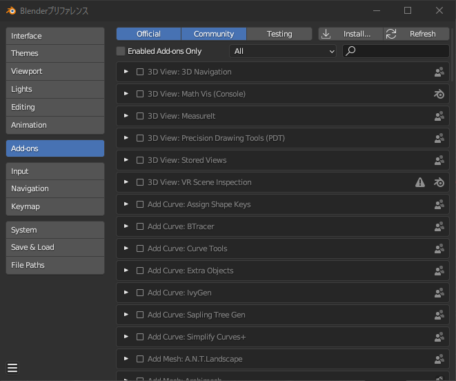

# Installing(Legacy Add-ons)

⚠[Please install Blender 4.2 or later from the extensions.](Installation_extension.md)

1. Go to [Release](https://github.com/Lucius64/kenshi_io_tools/releases)

    

1. Download ZIP file

    
    - Download according to the version of Blender you use.

        | Blender version | Target version |
        | --- | --------- |
        | 2.79 | 2.79 |
        | 2.80 to 3.5 | 2.80 |
        | 3.6 to 4.3  | 3.6 |

1. Launch Blender
1. Open Preferences and click Install for the add-on.

    

1. Select the downloaded ZIP file

1. Enable Add-on

    

# Uninstalling(Legacy Add-ons)

1. Disable Add-on

1. Relaunch Blender

1. Open Preferences and click Remove for the add-on.

## Add-ons version 1.3.0 and later

1. Open Preferences and click Remove for the add-on.

1. If the deletion fails, restart Blender and try again.