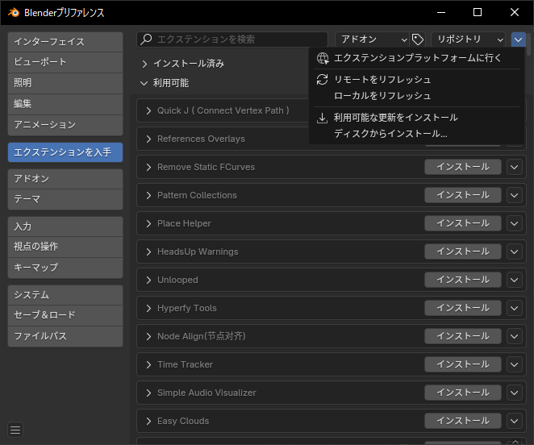
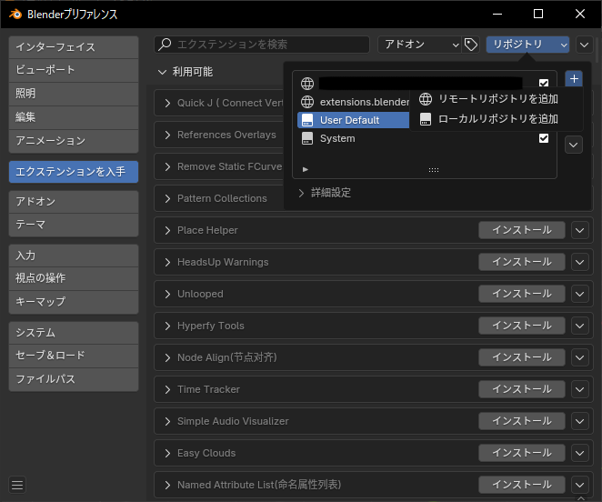
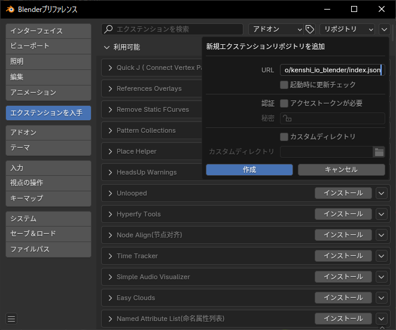
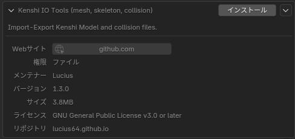
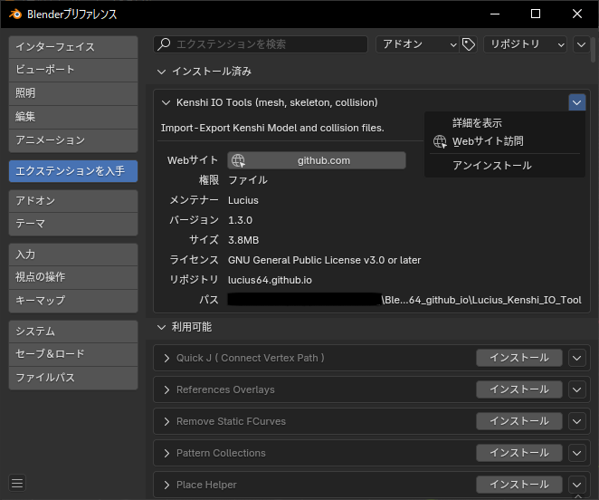

# インストール方法(拡張機能のアドオン)

## オフラインインストール
オフラインで拡張機能をインストールできます。

 - ✅ Blenderのオンラインアクセスの許可が不要
 - ❌ 自動アップデート非対応

1. [Release](https://github.com/Lucius64/kenshi_io_tools/releases)に移動

    

1. ZIPファイルをダウンロード

    
    - 使用するBlenderのバージョンに応じてダウンロードします。

        | Blender バージョン | ターゲット バージョン |
        | --- | --------- |
        | 4.2 to 4.3 | 4.2 |
        | 4.4 or later | 4.4 |

1. Blenderを起動

1. Blenderプリファレンス > エクステンションを入手 > ディスクからインストール

    

1. ダウンロードしたZIPファイルを選択

    Blenderプリファレンス > アドオン でインストールしたアドオンを確認できます。

## オンラインインストール
リモートリポジトリから拡張機能をインストールできます。

 - ✅ Blenderで更新の確認とダウンロードが可能
 - ❌ Blenderのオンラインアクセスの許可が必要

1. Blenderプリファレンス > エクステンションを入手 > リポジトリ > リモートリポジトリを追加

    

1. URLに`https://lucius64.github.io/kenshi_io_blender/index.json`を入力

    

    「起動時に更新チェック」を有効にするとバージョンアップの通知を受け取れます。

1. Kenshi IO Tools (mesh, skeleton, collision)をインストール

    

    Blenderプリファレンス > アドオン でインストールしたアドオンを確認できます。

# アンインストール方法(拡張機能のアドオン)

1. Blenderプリファレンス > エクステンションを入手

1. Kenshi IO Tools (mesh, skeleton, collision)をアンインストール

    
