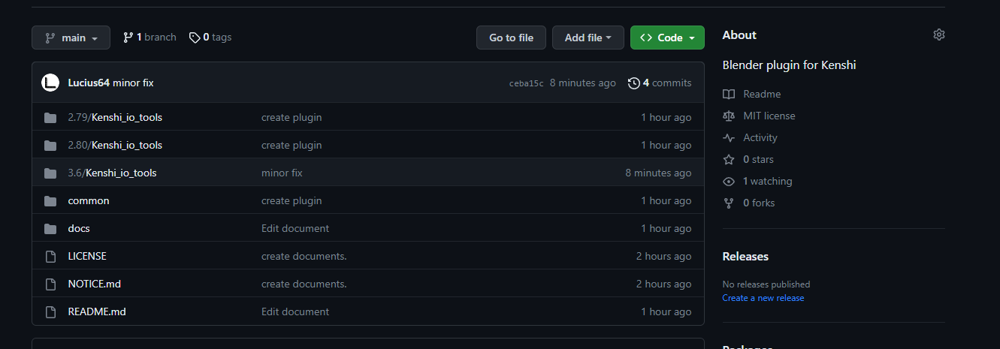

# Installing(Extensions)

## Offline install
You can install extensions offline.

 - ✅ No permission required for online access
 - ❌ Automatic update not supported

1. Go to [Release](https://github.com/Lucius64/kenshi_io_tools/releases)

    

1. Download ZIP file

    
    - Download according to the version of Blender you use.

        | Blender version | Target version |
        | --- | --------- |
        | 4.2 to 4.3 | 4.2 |
        | 4.4 or later | 4.4 |

1. Launch Blender

1. Blender Preferences > Get Extensions > Install from Disk

    

1. Select the downloaded ZIP file

    You can check the installed add-ons in Blender Preferences > Add-ons.

## Online install
You can install extensions from remote repositories.

 - ✅ Check for and download updates on Blender
 - ❌ Online access permission required

1. Blender Preferences > Get Extensions > Repositories > Add Remote Repositories

    

1. Set the URL to `https://lucius64.github.io/kenshi_io_blender/index.json`

    

    If you enable "Check for updates at startup", you will receive notifications of new versions.

1. Install Kenshi IO Tools (mesh, skeleton, collision)

    

    You can check the installed add-ons in Blender Preferences > Add-ons.

# Uninstalling(Extensions)

1. Blender Preferences > Get Extensions

1. Uninstall Kenshi IO Tools (mesh, skeleton, collision)

    
