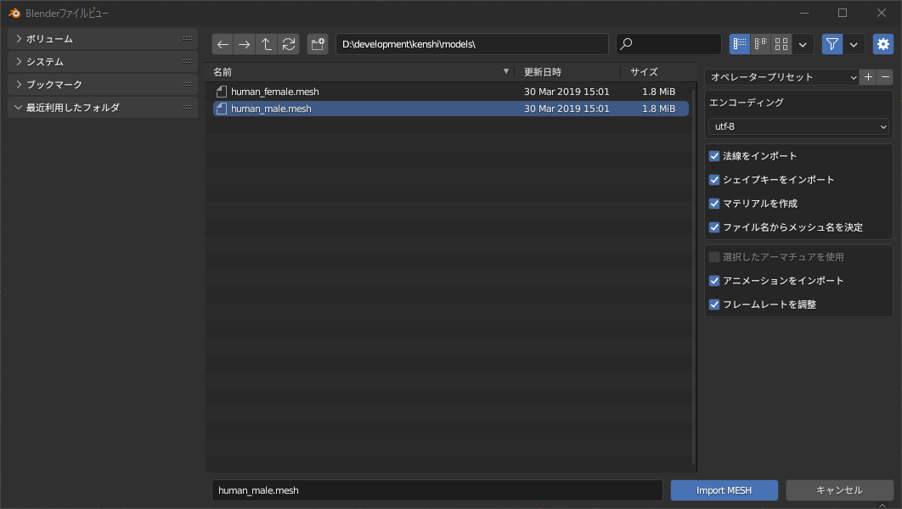
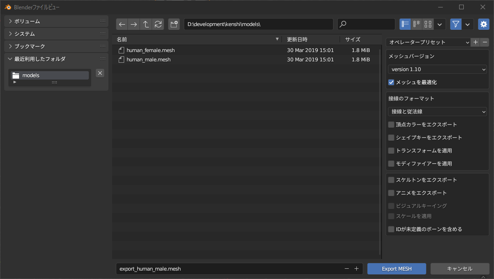
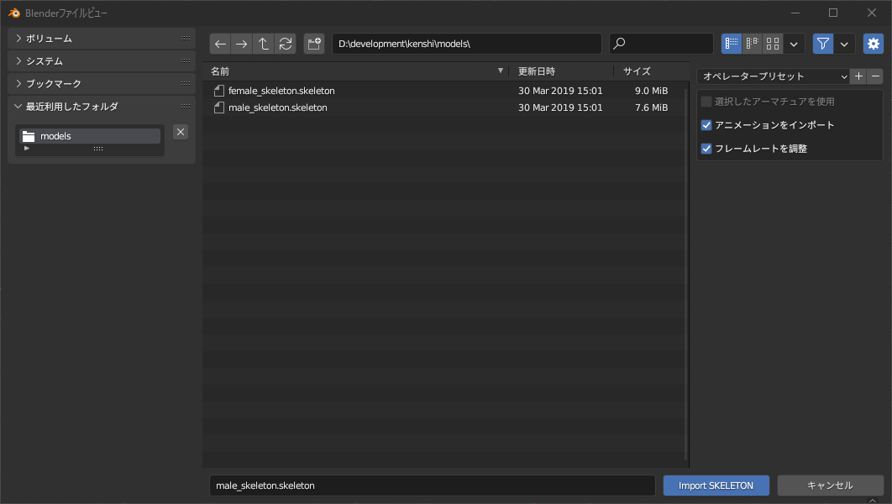
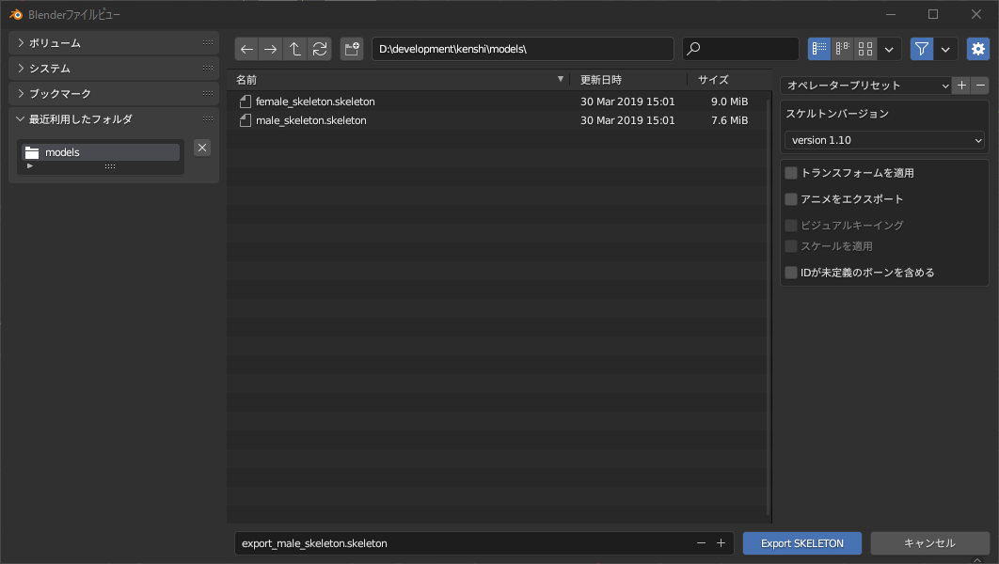

# オプションの説明

## Import mesh

1. エンコーディング
    - 選択した文字コードでメッシュとマテリアルの名前をエンコーディングします。

1. 法線をインポート
    - 有効にすると頂点法線(Blenderは分割法線と呼ぶ)を適用します。

1. マテリアルを作成
    - 有効にするとファイルに含まれるマテリアル名を使ってマテリアルを追加します。

1. ファイル名からメッシュ名を決定
    - 有効にするとメッシュ名が{ファイル名}_{サブメッシュインデックス}になります。
    - 無効にするとメッシュ名がファイルに含まれるサブメッシュ名になります。該当項目がなければ有効時と同じになります。

1. 選択したアーマチュアを使用
    - 有効にするとアクティブなアーマチュアとリンクしてメッシュをインポートします。
    - 主に防具のメッシュをインポートするときに有効化します。
    - アクティブなオブジェクトがアーマチュアでない場合は、このオプションを無視します。

1. アニメーションをインポート
    - 有効にするとメッシュとリンクしているスケルトンをインポートする際に、アニメーションをアクションとしてインポートします。

1. フレームレートを調整
    - 有効にするとアニメーションに合わせてシーンのFPSを変更します。

## Export mesh

1. メッシュバージョン
    - 選択したバージョンでメッシュ(とスケルトン)をエクスポートします。
    - 基本的に初期値である「version 1.10」を選択し、特定のツールで読み込む際に指定のバージョンを選択します。

1. メッシュを最適化
    - 有効にすると重複した頂点情報を除去してエクスポートします。

1. 接線のフォーマット
    - 基本的に「接線と従法線」を使います。
    - UVマップがない場合は、暗黙的に「接線なし」でエクスポートします。

1. 頂点カラーをエクスポート
    - 有効にすると頂点カラーをエクスポートします。

1. シェイプキーをエクスポート
    - 有効にするとシェイプキーをエクスポートします。

1. トランスフォームを適用
    - 有効にするとトランスフォームを適用した状態でエクスポートします。

1. モディファイアを適用
    - 有効にするとモディファイアを適用した状態でエクスポートします。

1. スケルトンをエクスポート
    - 有効にするとをアーマチュアをスケルトンとしてエクスポートします。
    - エクスポート対象はメッシュのアーマチュアモディファイアが参照するオブジェクトです。

1. アニメーションをエクスポート
    - 有効にするとスケルトンにアニメーションを含めてエクスポートします。
    - エクスポート対象はアーマチュアに含まれるNLAトラックのアクションと現在参照しているアクションです。

1. ビジュアルキーイング
    - 有効にするとボーンコンストレイントやドライバーを適用した状態でアクションをベイクします。ただし、エクスポートに時間がかかります。
    - 無効にするとアクションのFカーブをベイクします。

1. スケールを適用
    - 有効にするとアニメーションにスケールのキーフレームを適用可能になります。

1. IDが未定義のボーンを含める
    - 有効にするとOGREIDプロパティのないボーンもIDを自動採番してエクスポートします。

## Import skeleton

1. 選択したアーマチュアを使用
    - 有効にするとアクティブなアーマチュアとリンクしてアニメーションをインポートします。
    - アクティブなオブジェクトがアーマチュアでない場合は、このオプションを無視します。

1. アニメーションをインポート
    - Import meshと同じです。

1. フレームレートを調整
    - Import meshと同じです。

## Export skeleton

1. スケルトンバージョン
    - 選択したバージョンでスケルトンをエクスポートします。
    - 基本的に初期値である「version 1.10」を選択し、特定のツールで読み込む際に指定のバージョンを選択します。

1. トランスフォームを適用
    - Export meshと同じです。

1. アニメーションをエクスポート
    - Export meshと同じです。

1. ビジュアルキーイング
    - Export meshと同じです。

1. スケールを適用
    - Export meshと同じです。

1. IDが未定義のボーンを含める
    - Export meshと同じです。
