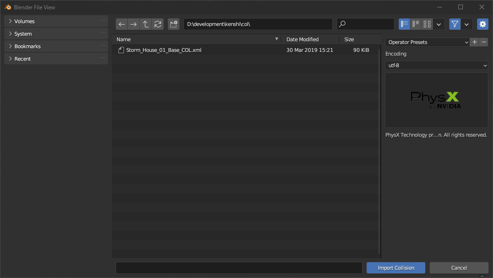
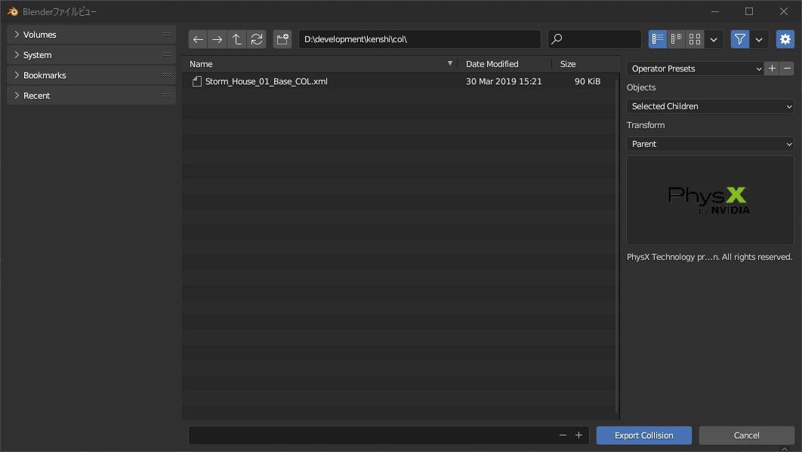

# Option description

## Import mesh

1. Encoding
    - Encodes mesh and material names in a character code of your choice.

1. Import Normals
    - If enabled, apply vertex normals (Blender calls them split normals).

1. Create materials
    - If enabled, add materials using the material names contained in the file.

1. Determine mesh name from file name
    - When enabled, the mesh name will be {filename}{submesh index}.
    - When disabled, the mesh name will be the sub-mesh name contained in the file. If there is no corresponding item, it will be the same as when enabled.

1. Use selected armature
    - When enabled, imports the mesh linked with the active armature.
    - Mainly enabled when importing armor meshes.
    - Ignore this option if the active object is not an armature.

1. Import animation
    - When enabled, animations will be imported as actions when importing skeletons linked to meshes.

1. Adjust frame rate
    - When enabled, changes the FPS of the scene to match the animation.

## Export mesh

1. Mesh version
    - Export mesh (and skeleton) in selected version.
    - Basically choose the default "version 1.10" and select the specific version when loading with a particular tool.

1. Optimize mesh
    - When enabled, duplicate vertex information is removed and exported.

1. Tangent format
    - I basically use "tangents and binormals".
    - If there is no UV map, it implicitly exports "no tangents".

1. Export vertex colour
    - When enabled, exports vertex colors.

1. Export shape keys
    - When enabled, exports shape keys.

1. Apply Transform
    - When enabled, it will be exported with the transform applied.

1. Apply Modifiers
    - When enabled, exports with modifiers applied.

1. Export skeleton
    - When enabled, exports the armature as a skeleton.
    - The export target is the object referenced by the armature modifier of the mesh.

1. Export Animation
    - When enabled, exports skeletons with animations.
    - The export target is the action of the NLA track contained in the armature and the currently referenced action.

1. Visual Keying
    - When enabled, the action will be baked with bone constraints and drivers applied. However, the export takes longer.
    - When disabled, the F-Curve of the action is baked.

1. Apply scale
    - When enabled, animations can have scale keyframes applied.

1. Include bones with undefined IDs
    - When enabled, bones without OGREID property will be automatically numbered and exported.

## Import skeleton

1. Use selected armature
    - When enabled, animations will be imported by linking with the active armature.
    - Ignore this option if the active object is not an armature.

1. Import animation
    - Same as Import mesh.

1. Adjust frame rate
    - Same as Import mesh.

## Export skeleton

1. Skeleton version
    - Export skeleton in selected version.
    - Basically choose the default "version 1.10" and select the specific version when loading with a particular tool.

1. Apply Transform
    - Same as Export mesh.

1. Export Animation
    - Same as Export mesh.

1. Visual Keying
    - Same as Export mesh.

1. Apply scale
    - Same as Export mesh.

1. Include bones with undefined IDs
    - Same as Export mesh.

## Import collision

1. Encoding
    - Encode the XML file with the selected character code.

## Export collision

1. Objects
    - "All Objects" exports all collision objects in the scene.
    - "Selection" exports only selected objects
    - "Selected Children" exports the selected object and all its child objects.

1. Transform
    -  Adjust the global position of the object.
    - "Scene" is relative to the origin of the scene.
    - "Parent" is relative to the common parent.
    - "Active" is relative to the active object.

